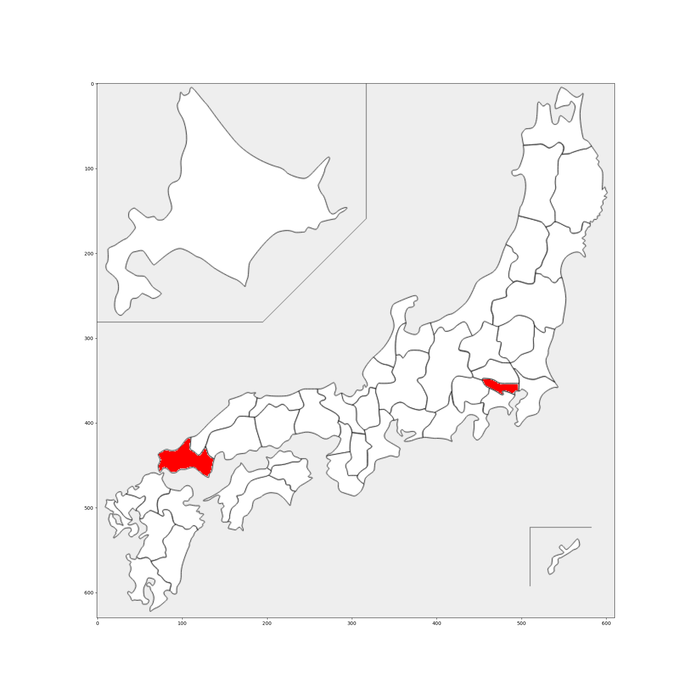

# plot_on_Japan

## 外部モジュールのインストール
`$pip install japanmap`

`$pip install pylab`

## 使用例

```
東京都
東京都
山口県
東京都
山口県
山口県
山口県
山口県
```

↑こんなデータを↓にする



## 参考にさせていただいたサイト
https://www.jcsc.co.jp/tech_blog/archives/50